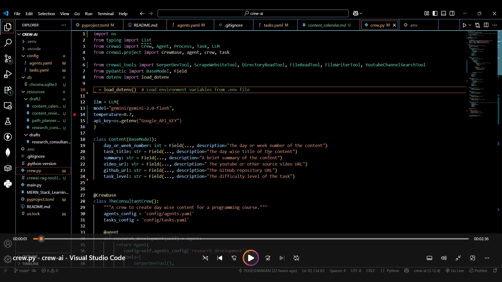

# Mentor Consulting Crew 🕸️🤖

Mentor Consulting Crew is an AI-powered project built with [Crew AI](https://github.com/crewAI/crewAI) designed to **build, research, and strategize comprehensive learning paths** for any course, from beginner to advanced level. The crew leverages multiple specialized AI agents to automate and streamline the process of educational planning and content creation, ensuring a high-quality, structured learning experience.

<!-- Badges Section -->
[](./LICENSE)
[](https://github.com/YUGESHKARAN/Mentor-Consulting-Crew/stargazers)
[](https://www.python.org/downloads/)

---

## 🎥 Demo Video

[](https://drive.google.com/file/d/17D6XhcGkbCjhurU54fDsZ4OWMUD-DcDQ/view?usp=sharing)


## 🚀 Purpose

The primary purpose of Mentor Consulting Crew is to **help learners master a specified course or topic**, delivering:

- **Research-backed learning paths** tailored to different learning levels and needs.
- **Engaging, accessible educational content** for every step of the journey.
- **Efficient task management** to ensure timely creation and delivery of resources.

This crew is ideal for self-learners, educators, bootcamps, and anyone needing a strategic roadmap for learning a complex topic from scratch.

---

## 🧑‍💻 Crew Structure & Agents

Mentor Consulting Crew consists of three core agents, each with a dedicated role:

### 1. `research_development` Agent

- **Role:** E-learning Research and Development Specialist
- **Goal:** Research and develop comprehensive learning paths, analyze educational trends, and curate high-quality resources for learners at all levels.
- **Backstory:** Expert in educational content development with a keen sense for effective learning methodologies, resource curation, and structured planning.

### 2. `content_creator` Agent

- **Role:** E-learning Content Creation Specialist
- **Goal:** Transform research and learning paths into engaging, accessible, and easy-to-understand content, tailored to each learning stage.
- **Backstory:** Skilled in educational writing, multimedia production, and simplifying complex concepts for all learners.

### 3. `tasks_scheduler` Agent

- **Role:** E-learning Tasks Scheduler
- **Goal:** Manage and schedule tasks for the crew, ensuring deadlines are met and collaboration between agents is smooth and efficient.
- **Backstory:** Experienced in project management and task coordination within the e-learning industry, adept with project management tools and workflows.

Agent configuration (sample from `agent.yaml`):

```yaml
research_development:
  llm: anthropic/claude-3-7-sonnet-20250219
  role: E-learning Research and Development Specialist
  goal: Research and develop comprehensive learning paths and resources...
  backstory: Expert in educational content development...

content_creator:
  llm: anthropic/claude-3-7-sonnet-20250219
  role: E-learning Content Creation Specialist
  goal: Create engaging and informative content...
  backstory: Skilled content creator with expertise in educational writing...

tasks_scheduler:
  llm: anthropic/claude-3-7-sonnet-20250219
  role: E-learning Tasks Scheduler
  goal: Manage and schedule tasks for the crew...
  backstory: Organized and detail-oriented individual with experience in project management...
```

---

## 🛠️ How It Works

1. **Input a target course or topic** (e.g., "MERN Stack", "Data Science", "Python for Beginners").
2. The **research_development** agent creates a detailed, step-by-step learning path, curates resources, and identifies educational trends.
3. The **content_creator** agent generates or adapts content for each stage, ensuring clarity and engagement.
4. The **tasks_scheduler** agent coordinates all tasks, tracks progress, and ensures all deadlines and dependencies are managed.
5. The final deliverable is a structured, actionable learning path with recommended resources, practice projects, and timelines.

---
 ### Create a `.env` file in the root directory:
 1. get google api key from [google ai studio](https://aistudio.google.com/apikey)
 2. Get serp api key from [serper dev](https://serper.dev/)   
   ```
   GOOGLE_API_KEY=<your_gemini_api_key>
   SERPER_API_KEY=<your_serper_dev_api_key>
  
   ```


## 📚 Reference Output: Data Science Learning Path

Below is a sample output generated by the crew for a full-stack web development for beginner to advanced level:

## Important Note:
**This project is still in the development stage. Some responses, such as content or links, may be inaccurate or irrelevant. To improve reliability, consider using a paid model and always review the generated content carefully before proceeding further.**

# Deep Learning Content Calendar

This content calendar provides a structured plan for learning Deep Learning from beginner to advanced levels over two months. It incorporates resources, video links, and GitHub repositories for each task.

**Start Date:** 2025-08-26
**Estimated Time to Complete:** 2 months

## Month 1: Foundations and Core Concepts

**Week 1: Introduction to Deep Learning and Neural Networks**

| Day | Topic/Subtopic | Resource Type | Title | Task to do | Task Level | Reference GitHub Repo Link | Reference Video Link | Estimated Time to Complete |
|---|---|---|---|---|---|---|---|---|
| Day 1 | Introduction to Deep Learning | Course | Introduction to Deep Learning | Overview of Deep Learning concepts, applications, and history. | Beginner | [https://github.com/mbadry1/Deep-Learning-Tutorials](https://github.com/mbadry1/Deep-Learning-Tutorials) | [https://www.youtube.com/watch?v=UKxKA9n-fOU](https://www.youtube.com/watch?v=UKxKA9n-fOU) | 4 hours (Module 1-4) |
| Day 2 | Deep Learning Course for Beginners | Video | Deep Learning Course for Beginners | Watch the first 2 hours to get a grasp of fundamental concepts. | Beginner | [https://github.com/dennybritz/cnn-text-classification-tf](https://github.com/dennybritz/cnn-text-classification-tf) | [https://www.youtube.com/watch?v=HJd1I3FdSnY](https://www.youtube.com/watch?v=HJd1I3FdSnY) | 2 hours |
| Day 3 | Neural Networks and Deep Learning - Chapter 1 | Book | Neural Networks and Deep Learning | Chapter 1: Using neural nets to recognize digits. Focus on understanding the structure of neural networks. | Beginner | [https://github.com/MichalDanielDobrzanski/DeepLearningPython](https://github.com/MichalDanielDobrzanski/DeepLearningPython) | [https://www.youtube.com/watch?v=xQm9K6iiM0o](https://www.youtube.com/watch?v=xQm9K6iiM0o) | 6 hours |
| Day 4 | Introduction to Deep Learning | Course | Introduction to Deep Learning | Complete the course. | Beginner | [https://github.com/mbadry1/Deep-Learning-Tutorials](https://github.com/mbadry1/Deep-Learning-Tutorials) | [https://www.youtube.com/watch?v=UKxKA9n-fOU](https://www.youtube.com/watch?v=UKxKA9n-fOU) | 4 hours |
| Day 5 | Neural Networks and Deep Learning - Chapter 2 | Book | Neural Networks and Deep Learning | Chapter 2: How the backpropagation algorithm works | Beginner | [https://github.com/Kulbear/deep-learning-nano-foundation](https://github.com/Kulbear/deep-learning-nano-foundation) | [https://www.youtube.com/watch?v=i94OvYb6noQ](https://www.youtube.com/watch?v=i94OvYb6noQ) | 6 hours |
| Day 6 | Basic Python for Deep Learning | Tutorial | Python tutorial | Go through the official python tutorial to learn the basics of the language. | Beginner | [https://github.com/python/cpython](https://github.com/python/cpython) | [https://www.youtube.com/watch?v=Y7qfW2S_DDY](https://www.youtube.com/watch?v=Y7qfW2S_DDY) | 4 hours |
| Day 7 | Neural Networks and Deep Learning - Chapter 3 | Book | Neural Networks and Deep Learning | Chapter 3: Improving the way neural networks learn | Beginner | [https://github.com/keras-team/keras](https://github.com/keras-team/keras) | [https://www.youtube.com/watch?v=zc8kmP5korg](https://www.youtube.com/watch?v=zc8kmP5korg) | 6 hours |

**Week 2: Deep Learning Fundamentals**

| Day | Topic/Subtopic | Resource Type | Title | Task to do | Task Level | Reference GitHub Repo Link | Reference Video Link | Estimated Time to Complete |
|---|---|---|---|---|---|---|---|---|
| Day 8 | Deep Learning Course for Beginners | Video | Deep Learning Course for Beginners | Watch the rest of the course. | Beginner | [https://github.com/dennybritz/cnn-text-classification-tf](https://github.com/dennybritz/cnn-text-classification-tf) | [https://www.youtube.com/watch?v=HJd1I3FdSnY](https://www.youtube.com/watch?v=HJd1I3FdSnY) | 2 hours |
| Day 9-14 | Dive into Deep Learning - Chapters 1-5 | Book | Dive into Deep Learning | Read and implement code examples. Focus on data manipulation, linear algebra, calculus, probability, and automatic differentiation. | Intermediate | [https://github.com/d2l-ai/d2l-en](https://github.com/d2l-ai/d2l-en) | [https://www.youtube.com/watch?v=v6vSgjLaKJM](https://www.youtube.com/watch?v=v6vSgjLaKJM) | 8 hours per day |

**Week 3: Convolutional Neural Networks (CNNs)**

| Day | Topic/Subtopic | Resource Type | Title | Task to do | Task Level | Reference GitHub Repo Link | Reference Video Link | Estimated Time to Complete |
|---|---|---|---|---|---|---|---|---|
| Day 15-21 | Dive into Deep Learning - Chapters 6-10 | Book | Dive into Deep Learning | Read and implement code examples. Focus on CNN building blocks, classic CNN architectures, and modern CNN architectures. | Intermediate | [https://github.com/d2l-ai/d2l-en](https://github.com/d2l-ai/d2l-en) | [https://www.youtube.com/watch?v=v6vSgjLaKJM](https://www.youtube.com/watch?v=v6vSgjLaKJM) | 8 hours per day |

**Week 4: Recurrent Neural Networks (RNNs)**

| Day | Topic/Subtopic | Resource Type | Title | Task to do | Task Level | Reference GitHub Repo Link | Reference Video Link | Estimated Time to Complete |
|---|---|---|---|---|---|---|---|---|
| Day 22-28 | Dive into Deep Learning - Chapters 11-15 | Book | Dive into Deep Learning | Read and implement code examples. Focus on sequence models, RNNs, LSTMs, GRUs, and attention mechanisms. | Intermediate | [https://github.com/d2l-ai/d2l-en](https://github.com/d2l-ai/d2l-en) | [https://www.youtube.com/watch?v=v6vSgjLaKJM](https://www.youtube.com/watch?v=v6vSgjLaKJM) | 8 hours per day |

## Month 2: Advanced Topics and Specializations

**Week 5: Advanced Deep Learning Techniques**

| Day | Topic/Subtopic | Resource Type | Title | Task to do | Task Level | Reference GitHub Repo Link | Reference Video Link | Estimated Time to Complete |
|---|---|---|---|---|---|---|---|---|
| Day 29-35 | Practical Deep Learning for Coders - Lesson 1-3 | Course | Practical Deep Learning for Coders | Start with Lesson 1, and proceed to Lesson 3. Focus on image classification and basic NLP. | Intermediate | [https://github.com/fastai/fastbook](https://github.com/fastai/fastbook) | [https://www.youtube.com/watch?v=2FaptKuuJys](https://www.youtube.com/watch?v=2FaptKuuJys) | 8 hours per day |

**Week 6: MIT Deep Learning**

| Day | Topic/Subtopic | Resource Type | Title | Task to do | Task Level | Reference GitHub Repo Link | Reference Video Link | Estimated Time to Complete |
|---|---|---|---|---|---|---|---|---|
| Day 36-42 | MIT Deep Learning 6.S191 - Lectures 1-5 | Course | MIT Deep Learning 6.S191 | Cover the fundamentals of deep learning, CNNs, and RNNs. | Advanced | [https://github.com/lexfridman/mit-deep-learning](https://github.com/lexfridman/mit-deep-learning) | [https://www.youtube.com/watch?v=njKP3c3cNrU&list=PLtBw6njQRU-rwp5__7C0oIVt269KUIjPQ](https://www.youtube.com/watch?v=njKP3c3cNrU&list=PLtBw6njQRU-rwp5__7C0oIVt269KUIjPQ) | 8 hours per day |

**Week 7: Deep Learning Specialization (Coursera)**

| Day | Topic/Subtopic | Resource Type | Title | Task to do | Task Level | Reference GitHub Repo Link | Reference Video Link | Estimated Time to Complete |
|---|---|---|---|---|---|---|---|---|
| Day 43-49 | Deep Learning Specialization - Course 1-3 | Course | Deep Learning Specialization | Cover Neural Networks and Deep Learning, Improving Deep Neural Networks, Structuring Machine Learning Projects. | Intermediate | [https://github.com/mbadry1/Deep-Learning-Specialization-Coursera](https://github.com/mbadry1/Deep-Learning-Specialization-Coursera) | [https://www.youtube.com/watch?v=Yw98J-1Hj_E&list=PLkDaE6sCnr6I0iw7KIg2WagxylKWSfZ98](https://www.youtube.com/watch?v=Yw98J-1Hj_E&list=PLkDaE6sCnr6I0iw7KIg2WagxylKWSfZ98) | 8 hours per day |

**Week 8: Specialization and Research**

| Day | Topic/Subtopic | Resource Type | Title | Task to do | Task Level | Reference GitHub Repo Link | Reference Video Link | Estimated Time to Complete |
|---|---|---|---|---|---|---|---|---|
| Day 50-56 | Deep Learning Specialization - Course 4-5 and Exploration | Course & GitHub | Deep Learning Specialization, awesome-deep-learning | CNNs, Sequence Models. Explore the awesome-deep-learning repository for interesting projects and tutorials. | Advanced | [https://github.com/ChristosChristofidis/awesome-deep-learning](https://github.com/ChristosChristofidis/awesome-deep-learning) | [https://www.youtube.com/watch?v=Yw98J-1Hj_E&list=PLkDaE6sCnr6I0iw7KIg2WagxylKWSfZ98](https://www.youtube.com/watch?v=Yw98J-1Hj_E&list=PLkDaE6sCnr6I0iw7KIg2WagxylKWSfZ98) | 8 hours per day |

## Additional Notes:

*   This is an intensive schedule. Adjust the pace to suit your learning style and availability.
*   Prioritize hands-on coding and experimentation to reinforce your understanding.
*   Join online communities and forums to ask questions and learn from others.
*   Explore additional resources such as NVIDIA DLI and DeepLearning.AI for more learning opportunities.
*   Keep up with the latest research by reading papers and following top researchers in the field.

---

This learning path is designed to take you from a beginner to an advanced Deep Learning developer in 2 months. The resources are structured to build upon each other, with each stage preparing you for the next. Remember to practice regularly and build your own projects to reinforce your learning.```

---

## 🏗️ Extending & Customizing

- **Add New Agents:** Easily extend with new roles (e.g., Assessment Designer, Feedback Aggregator).
- **Change LLMs:** Swap out models in `agent.yaml` to fit your needs.
- **Customize Workflows:** Adapt the pipeline for different domains or learning structures.

---

## 📦 Getting Started

> **Requirements:** Python, Crew AI, API access to your preferred LLMs.

1. **Clone this repository:**
   ```sh
   git clone https://github.com/YUGESHKARAN/Mentor-Consulting-Crew.git
   cd Mentor-Consulting-Crew
   ```
2. **Configure agents:**  
   Edit `agent.yaml` to specify agent goals, roles, and LLMs.
3. **Run the crew:**  
   Follow the instructions in the [Crew AI documentation](https://github.com/crewAI/crewAI) or your integration script.

---

## 🤝 Contributing

Contributions, ideas, and feedback are welcome!  
Feel free to open issues or submit pull requests to make Mentor Consulting Crew even better.

---

## 📜 License

[MIT](./LICENSE)

---

## 💡 Inspiration

The **Mentor Consulting Crew** project was inspired by the CrewAI tutorial from Codebasics. Special thanks to the Codebasics team for sharing such valuable content.  
You can find their GitHub repository here: [https://github.com/codebasics/crewai-crash-course.git](https://github.com/codebasics/crewai-crash-course.git)

---
